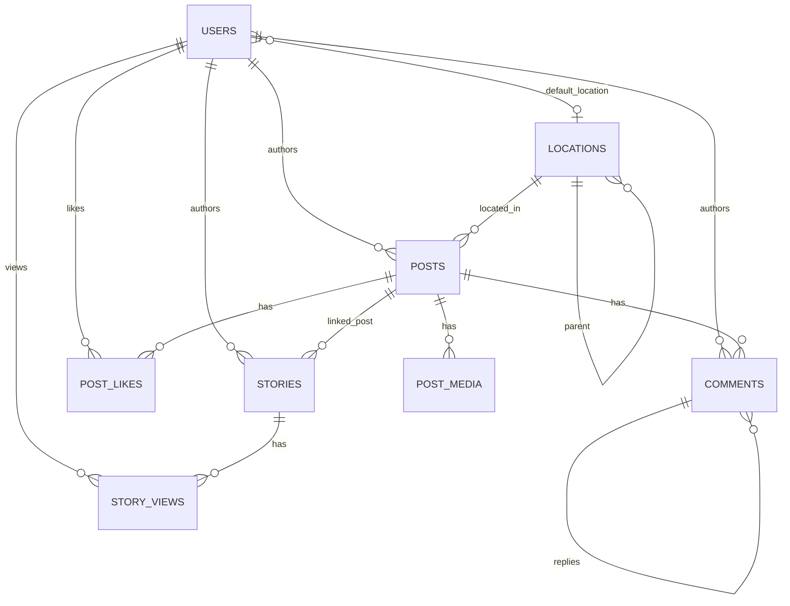

# Expert Listing Backend

## 1. What this is

The backend for **Expert Listing**, a property-listing social feed — the feed,
composer, likes, comments, filters, locations, uploads and stories rail behind the
Flutter app that is the other half of this assessment. Node.js + TypeScript + Express
5 on Vercel (serverless, zero-config), backed by a single Supabase Postgres database.

- Production: **https://expert-listing-backend.vercel.app**
- Health check: **https://expert-listing-backend.vercel.app/api/v1/health**
- Full endpoint reference: [`docs/API.md`](docs/API.md)
- Request collection (copy-paste `.http` requests, local and prod): [`docs/requests.http`](docs/requests.http)

**Stack:** Node 20 · TypeScript (ESM, `NodeNext`) · Express 5 · Supabase Postgres via
`postgres.js` (queries) and `@supabase/supabase-js` (Storage) · Zod v4 · Pino ·
Vitest + Supertest.

---

## 2. How to run it

**Prerequisites:** Node 20+ (see `.nvmrc`), a Supabase project.

```bash
1. npm install
2. cp .env.example .env               # fill in the values below
3. npx supabase link --project-ref <ref>
4. npm run db:push                    # applies supabase/migrations/*.sql
5. npm run db:seed                    # applies supabase/seed.sql (idempotent — wipes and re-inserts)
6. npx tsx scripts/setup-storage.ts   # creates the 3 Storage buckets (also idempotent)
7. npm run dev
8. curl localhost:3000/api/v1/health
```

`npm run verify` checks env parsing and database connectivity in one step if step 8
fails — run it before anything else if `dev` won't start.

### Scripts

| Script | Description |
|---|---|
| `dev` | Dev server with hot reload (`tsx watch`) |
| `verify` | Validates env vars and pings the database |
| `typecheck` | `tsc --noEmit` |
| `lint` | ESLint |
| `format` | Prettier, write mode |
| `test` | Runs the full test suite (unit + integration) twice with identical results — see below |
| `db:push` | Pushes `supabase/migrations/*.sql` to the linked project |
| `db:seed` | Runs `supabase/seed.sql` via `scripts/seed.ts` |
| `db:reset` | Resets the linked project's database entirely |

Not a package script, but worth knowing: `npx tsx scripts/setup-storage.ts` (Storage
buckets) and `npx tsx scripts/smoke.ts --base <url>` (hits every route against a live
deployment, prints status + latency, exits non-zero on failure — the last thing to run
before recording a demo).

### Environment variables

| Variable | Where it comes from |
|---|---|
| `NODE_ENV` | `development` \| `test` \| `production` |
| `PORT` | Local dev server port (default `3000`; unused on Vercel) |
| `LOG_LEVEL` | Pino level: `fatal`..`trace`, or `silent` |
| `DATABASE_URL` | Supabase dashboard → Project Settings → Database → Connection string → **Transaction pooler**, port `6543` |
| `DIRECT_DATABASE_URL` | Same page → **Session pooler**, port `5432` |
| `SUPABASE_URL` | Project Settings → API → Project URL |
| `SUPABASE_SERVICE_ROLE_KEY` | Project Settings → API → `service_role` secret key |
| `SUPABASE_ANON_KEY` | Project Settings → API → `anon`/publishable key |
| `MOCK_USER_ID` | Any seeded user id — defaults to `miracle.h`'s fixed uuid; see Assumptions |
| `CORS_ORIGINS` | `*` for this demo, or a comma-separated allowlist |
| `RATE_LIMIT_MAX` | GET requests/min per IP (default `100`) |
| `RATE_LIMIT_WRITE_MAX` | POST requests/min per IP (default `20`) |

**The two connection strings, and why the direct host doesn't work here.** Supabase
gives you three ways to reach the same database: a direct connection
(`db.<ref>.supabase.co:5432`), and two pooled connections through Supavisor —
transaction mode on `6543` and session mode on `5432`, both at
`aws-0-<region>.pooler.supabase.com`. This project uses **only the pooled hosts**.
The direct host resolves to an **IPv6-only** address; Vercel's serverless functions
run on an IPv4-only network path, so any attempt to reach it fails with `ENETUNREACH`
— it works from a laptop with IPv6 connectivity and then mysteriously stops working
the moment it's deployed. The two pooled connections split by workload for a
different reason: the **transaction pooler** (`DATABASE_URL`, 6543) is what
`src/config/db.ts` uses at runtime, because it scales down to near-zero idle
connections between requests, which matters when every request may be a cold
serverless invocation — but it does not support prepared statements, hence
`prepare: false` in that file. The **session pooler** (`DIRECT_DATABASE_URL`, 5432)
holds one real backend connection per client for the connection's lifetime, which is
what `supabase db push` and `scripts/seed.ts` need for prepared statements and
multi-statement transactions to work at all. Getting this backwards is the single
most time-consuming mistake to make on this stack — save the hour.

---

## 3. Endpoints

⭐ marks the four endpoints the brief names explicitly. Full parameter tables, example
requests/responses and every error code live in [`docs/API.md`](docs/API.md).

| Method | Path | Purpose | |
|---|---|---|---|
| `GET` | `/health` | Liveness/readiness probe | |
| `GET` | `/me` | The mock-authenticated viewer's own profile | ⭐ |
| `GET` | `/posts` | Paginated, filterable feed | ⭐ |
| `POST` | `/posts` | Composer — create a post | |
| `POST` | `/posts/:id/like` | Idempotent like/unlike toggle | ⭐ |
| `GET` | `/posts/:id/comments` | Paginated root comments (+ reply previews) | ⭐ |
| `POST` | `/posts/:id/comments` | Create a comment or one-level reply | ⭐ |
| `GET` | `/locations` | Typeahead location search | |
| `GET` | `/filters/options` | Static + dynamic filter-sheet metadata | |
| `GET` | `/stories` | Stories rail, unseen-first | |
| `POST` | `/uploads/sign` | Signed direct-to-Storage upload URL | |

---

## 4. Schema

Eight tables survive; twelve more were built and deliberately dropped (see §5).

| Table | Purpose |
|---|---|
| `users` | Public profile row; mirrors `auth.users` once real auth exists |
| `locations` | Self-referencing hierarchy — country (0) → state (1) → city (2) → area (3) |
| `posts` | The core content row: general/property/request, denormalised counters |
| `post_media` | 0–10 ordered images/videos per post |
| `comments` | Root comments plus one level of replies (`root_comment_id`, `depth`) |
| `post_likes` | `(post_id, user_id)` composite PK — see below |
| `stories` | 24h-expiring media per author |
| `story_views` | Per-viewer seen/unseen state, drives the ring colour |



### Design decisions worth defending

- **`post_type` and `transaction_type` are separate axes**, not one combined enum.
  Two CHECK constraints (`chk_transaction_matches_type`, `chk_transaction_direction`)
  enforce that a `general` post carries no transaction, and that a `request` can
  never be `for_sale` — a request can only ever *seek* (`looking_to_*`), a property
  can only ever *offer* (`for_sale`/`for_rent`/`for_shortlet`). `POST /posts`' zod
  schema mirrors both constraints so the composer gets a field-targeted 400 instead
  of a generic database error, but the CHECK is the real guarantee.
- **`post_likes` has composite primary key `(post_id, user_id)`.** Idempotency is a
  storage-layer property, not application logic — a duplicate like is a primary-key
  violation the database refuses by construction, which is why `toggle_post_like`
  can use a bare `INSERT ... ON CONFLICT DO NOTHING` with no locking code, and why 10
  concurrent identical likes (see `tests/like.idempotency.test.ts`) reliably leave
  exactly one row.
- **Counters are denormalised and trigger-maintained**, not computed per request.
  `posts.like_count`/`comment_count`/`media_count` update via triggers on the source
  tables, so `get_feed()` never runs a correlated `COUNT(*)` per row across three
  joined tables for every card in a scrolling feed. `recompute_post_counters()`
  exists as the manual repair path if a trigger is ever bypassed, and is what every
  integration test calls in its teardown.
- **Keyset pagination, not offset.** Every cursor is an opaque `(created_at, id)`
  pair, not a page number. Offset pagination re-runs `OFFSET n LIMIT m` against a
  table that keeps receiving new rows at the front — on an insert-heavy feed, a
  viewer scrolling past page 3 can see page 2's last few rows again, or skip rows
  entirely, as the offset drifts under them mid-scroll. A keyset cursor anchors to a
  specific row and is stable regardless of what's inserted afterward. See
  `src/utils/cursor.ts` and `tests/feed.pagination.test.ts` (the `limit=7` sweep is
  sized specifically to land page boundaries on the seed data's microsecond ties).
- **`get_feed()` assembles everything in one query via LATERAL joins** — post,
  author, media array, top comment, the 3 most recent likers, and
  `viewer_has_liked` — rather than the feed handler making five separate round
  trips per page (or one query per post, i.e. N+1). The tradeoff is a wide,
  carefully-indexed function instead of thin, composable queries; worth it because
  this is the single highest-traffic read in the app.
- **Soft deletes via `deleted_at`**, on `users`, `posts` and `comments` — a delete
  never actually removes a row, so a comment thread with a deleted parent can still
  render its live replies, and nothing downstream (counters, RLS policies, `get_feed`)
  has to special-case a hard delete that never happens.

### Row Level Security

`users`, `posts`, `post_media`, `comments` and `post_likes` have public, read-only
`SELECT` policies for `anon`/`authenticated` — the client-facing read surface a real
Supabase deployment would actually expose via PostgREST. `locations`, `stories` and
`story_views` have RLS enabled with **zero** policies (deny-all), since nothing reads
them directly outside this API. Every write in this codebase goes through the service
role (`src/config/db.ts`'s connection, and the five `SECURITY DEFINER` RPCs), which
bypasses RLS entirely — these policies exist for defense in depth against a leaked
anon key, not because this Express API is subject to them. There is deliberately no
`current_app_user()` helper: without real auth, `auth.uid()` is always `NULL`, so an
owner-scoped policy referencing it today would be dead code that just breaks when
auth arrives and someone forgets to update it.

---

## 5. What I skipped

**Out of scope per the brief:** real authentication (mocked via `X-User-Id`, see
Assumptions), payments, a Redis-backed rate limiter (see Known limitations), a CDN in
front of Storage.

**Cut by a deliberate scope-correction commit**, not a bug fix — migration `0012b`
(`supabase/migrations/20260905083856_scope_cleanup.sql`) drops twelve tables built in
earlier parts that render in the Figma design but back no interaction the brief
requires: the follow graph, comment likes, bookmarks, post shares, post views,
notifications, reports, blocks, saved filters, hashtags, post_hashtags, and mentions.
Nothing built in those parts was wrong — a reviewer of the migration history should
expect to see these tables appear and then disappear. Cut alongside them: bookmark,
share, view-ingest and story-view endpoints, and both DELETE endpoints (post,
comment) — none were ever built, since the tables and interactions behind them don't
exist. The brief names only like, comment and filter as needing to actually work.

**`share_count`, `bookmark_count` and `view_count` on `posts` are seeded integers with
no backing table.** They render real-looking numbers in the feed (`recompute_post_counters()`
explicitly never touches them — see its header comment), but nothing increments
them; there is no `POST /posts/:id/share`, no `POST /posts/:id/bookmark`, no view
ingest. This is a deliberate product-surface-vs-backed-interaction split, not an
oversight, and follows directly from the scope cut above.

**Not built at all:** Search, List, Notification and Profile tabs — this brief is the
feed/detail interaction surface (feed, composer, like, comment, filter, stories,
uploads), not the whole app's screen set.

---

## 6. Assumptions

- **`post_type` and `transaction_type` as separate axes** (see §4) rather than one
  combined enum like `property_for_rent` — keeps the two CHECK constraints
  independently readable and lets the filter sheet offer transaction type as its own
  facet.
- **The role badge (`· Developer`, `· Agent`) shows only on `property` posts** by an
  author who has a role — Boyd's property listings show `· Developer`, but Felix's
  *request* posts show nothing despite Felix being a broker. A request is someone
  looking, not a professional listing; the badge is read as a claim about the
  listing, not the person.
- **Counts are returned as raw integers, with no hiding or abbreviation** —
  `like_count`, `view_count`, etc. are always present and always numeric. The
  product rule from the design read-out (zero counts hidden, view counts hidden
  below 100, `1K`-style abbreviation above that) is a client-side rendering
  decision, not something this API enforces; formatting an integer is the Flutter
  app's job, not this backend's.
- **"Liked by X and N others" is the 3 most recent likers** (`get_feed()`'s
  `liked_by` LATERAL, `ORDER BY created_at DESC LIMIT 3`), not a follow-aware or
  "people you know first" ranking — there is no follow graph left to rank by (§5).
- **One level of comment replies**, enforced at three layers: the `depth` CHECK
  constraint, a guard trigger closing the gap the CHECK alone can't (a depth-1
  comment can't detect a depth-1 parent from a single-row CHECK), and zod/
  `MAX_REPLY_DEPTH` surfacing it as a clean 409 before either fires in the ordinary
  case.
- **The filter sheet's actual contents are this project's own call** — the Figma
  design shows a filter button with no expanded state. `GET /filters/options`
  returns post type, transaction type (paired to its post type), the 20 most-posted
  locations, bedroom floors, a posted-within window, and a dynamic price range
  derived from live data, because that's what the feed's own filter params
  (`GET /posts`'s query schema) actually support.
- **Stories: green ring unseen, grey seen, 24h expiry** — `stories.expires_at`
  defaults to `created_at + 24 hours` and is filtered at read time (no cron
  cleanup); `story_views` existing for a (story, viewer) pair is what flips the
  ring from unseen to seen.
- **Mock current user via `X-User-Id`**, defaulting to `miracle.h`
  (`00000000-0000-0000-0000-000000000001`) when absent or malformed — see
  `src/middleware/mockAuth.ts`. This is the one seam a real JWT check would replace;
  nothing downstream cares how `req.user.id` got populated.
- **Avatars and post/story images are external placeholder services**
  (`i.pravatar.cc`, `picsum.photos`), not uploaded assets — there is no Storage
  object behind a seeded row's `avatar_url`/`public_url`. Real uploads go through
  `POST /uploads/sign` and land in one of the three Storage buckets
  (`scripts/setup-storage.ts`), which is a fully working, separately-tested path;
  the seed data just doesn't use it, because seeding 40 posts' worth of real media
  isn't worth the storage cost.
- **A copy-paste artefact in the Figma mock** (a body string reading something like
  `...end of next month.rviced...`, where two unrelated captions were pasted over
  each other) is treated as a lorem-ipsum accident, not a real listing description —
  `supabase/seed.sql` has fresh, sensible seed copy in its place rather than
  reproducing the artefact.

---

## 7. Known limitations

- **Rate limiting is per-instance.** `express-rate-limit`'s default store is an
  in-memory `Map` scoped to one running process. On Vercel's serverless runtime,
  each concurrent instance gets its own counter, so the real ceiling under load is
  `limit × concurrent instance count`, not the configured `limit` — a shared,
  cross-instance limit needs a shared store (Redis), which is out of scope here.
  This is disclosed rather than implied as a guarantee it isn't.
- **CORS is fully open** (`CORS_ORIGINS=*`) — correct for a public demo API a
  reviewer curls directly, wrong for a real deployment, which would restrict it to
  known origins.
- **Cold start of roughly 1–3 seconds** on an idle serverless function (visible as
  the first request's latency in `scripts/smoke.ts`'s output after a period of no
  traffic).
- **Vercel preview deployments sit behind Vercel's SSO wall** — only the production
  URL is reachable without a Vercel account; use
  `https://expert-listing-backend.vercel.app` for review.

---

## 8. Notable engineering notes

- **`postgres.js` truncates microsecond precision when a plain JS string is bound
  against a `::timestamptz` cast** — it round-trips the value through a JS `Date`
  (millisecond precision) even on write, not just on read. Seed data routinely ties
  multiple rows on the exact microsecond, so a naive keyset cursor comparison would
  silently skip or repeat a row exactly at that tie boundary. Fixed with
  `sql.typed(value, 25)` (forces the TEXT oid so the raw string reaches Postgres
  untouched) — see `src/config/db.ts`'s `typedTimestamp()`.
- **`JSON.stringify(payload) + '::jsonb'` double-encodes a JSON parameter.**
  `postgres.js` already auto-encodes any value passed through its own `sql.json()`
  helper; pre-stringifying it yourself and casting the resulting string produces a
  jsonb *string* containing escaped JSON text, not a jsonb *object* — every
  `->>'key'` extraction inside the receiving function then silently returns `NULL`.
  `sql.json(payload)`, not `JSON.stringify`, is the correct binding — see
  `src/repositories/posts.repo.ts`'s `createPost()`.
- **Calling a volatile Postgres function and reading its own write back in the same
  round trip is not safe**, in either of two forms that look reasonable: a
  `WHERE id = some_volatile_fn(...)` (risks the planner re-evaluating the function
  per scanned row) or a `WITH x AS (SELECT some_volatile_fn(...))` CTE joined to the
  written table in the same statement (the insert isn't guaranteed visible to a join
  in the same top-level query). The only pattern that reliably works is two separate
  sequential statements — insert-and-get-id, then a second query to read the row
  back. `createPost()` and `comment.service.ts`'s `createComment()` both do this.
- **Vercel's zero-config Express detection can pick either `app.ts` or `server.ts`**
  as the serverless entry point, and its Node.js runtime requires that entry's
  default export to be a callable request handler. Both files satisfy that: `app.ts`
  default-exports the built Express app itself (which is a valid handler), while
  `server.ts` (the local entry, and the one that actually calls `.listen()`) also
  default-exports it.
- **Express 5 makes `req.query` a getter-only accessor**, parsed lazily from the raw
  URL — a validation middleware that tries `req.query = parsed` throws
  `Cannot set property query ... which has only a getter`. `src/middleware/
  validate.ts` works around it with `Object.defineProperty` for the `query` target
  specifically; `body`/`params` are still plain writable properties and don't need
  it.
